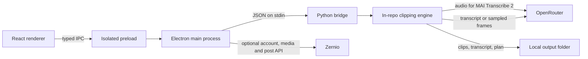

# Architecture and data flow



The renderer is sandboxed and cannot read saved provider keys. Main owns secure storage, validates IPC callers and job options, grants local media access through the native file picker, starts one worker job at a time, and checks the worker's JSON-line messages. A dropped local file opens that picker; its renderer-supplied path alone does not grant access. The bridge runs BridgeClip’s bundled Python engine in local mode and reserves stdout for progress and results. FFmpeg renders locally. A link is downloaded using the user's network connection into a temporary job workspace, which the engine removes after normal completion or failure; Electron also removes job work after the worker exits and sweeps stale work at startup. The original local source stays in place; finished clips, transcript, plan and result JSON persist in the output folder. Transcription and planning requests go directly to OpenRouter; when speech is unavailable, sampled frames replace transcript text for OpenRouter planning. Optional social-account management calls Zernio from main using the user's own Zernio key; browser sign-in returns through a one-time loopback callback. Posting also stays in main: it validates the selected clip and connected accounts, obtains a presigned media URL, uploads the clip, and sends the caption, targets and schedule to Zernio. Local post status, clip paths and titles, account handles, targets, links, and upload retry details are saved in the app data folder. On a Zernio key change, records from the previous workspace are hidden and quarantined on disk; a later cleanup can remove quarantine files after 30 days.

Saved run files are treated as untrusted input when loaded into the Library. The app shows sanitized diagnostics rather than raw provider or subprocess output. The Python bridge blocks private TCP destinations at connection time, including after URL redirects and DNS changes. Native or separate executable network clients need independent review before being added to the local pipeline.

Smart framing analyzes each render window at four frames per second. In addition to color-based shot cuts, sustained changes between a small corner webcam and a large central face split the window into independently classified layout segments. Brief detection gaps keep the current layout; persistent gaps get a fresh classification. With AI vision enabled, each segment can send its own representative image to OpenRouter, so videos with more layout changes can incur additional vision cost. Images and face hints come from the same moment inside that segment, and cached answers distinguish face positions and sizes. Positive evidence of a full-screen speaker can replace a stale webcam crop. Within a screen-and-camera shot, the planner also compares faces with a stable compact presenter observed inside the camera region. A substantial increase in both face height and width, combined with displacement, can switch to a single face-tracked view even when the presenter stays near an edge and the shared background does not change. Three samples spanning 500 ms confirm both the punch-in and the return to split view; boundaries are backdated to the first observation and recorded in the inspector. Brief movements and shared-content faces alongside a visible webcam do not trigger this rule. This check uses existing detections and adds no provider calls. The renderer applies the resulting segment boundaries on the existing edit timeline; it does not change audio timing to switch framing.

When a frame has a face score of at least 0.90, competing detections below 0.85 are excluded from tracking, layout evidence and vision hints; their raw observations remain in the inspector. This prevents a large, weak background detection from outranking a confident face solely on size. A sole weaker detection can still be used. Local image analysis also checks for rectangular video content surrounded by matching, low-detail side margins, including black, white and lightly textured padding. Three observations over 500 ms confirm an inset appearing, disappearing or changing geometry, backdated to the first observation. These transitions survive short-shot merging. A stable inset uses median region bounds and fits the entire region into the output over a blurred fill, holding its composition until the view changes. It needs no vision call; diagnostics label the inset region and content boundaries. Fit and landscape modes continue to preserve the source frame. Detailed, asymmetric or moving backgrounds may not qualify as padding and use normal framing instead.

Webcam regions are refined against nearby continuous image edges using up to three existing keyframes per segment, requiring two supported edges and agreement across available frames. The original region is checked before a face-transferred estimate, so a person leaning does not move a stationary camera boundary when the image edges still support it. Uncertain boundaries retain their estimate. Camera crop origins round inward to even source pixels, preventing slivers of the surrounding screen from leaking into the panel. Significant horizontal face offsets can tighten the crop while retaining head-and-shoulders room; the existing enlargement cap and centered blurred-fill fallback still apply. The inspector distinguishes edge-refined webcam bounds from estimates; no extra provider calls are made for refinement.

The planned supported release builds are macOS Apple silicon and Intel. Windows source builds are experimental. The Python engine and its assets live in `engine/` in this repository; release builds package that source directly. No separate engine repository is needed.

Optional framing capture records immutable version-1 `clip_NN.framing.json` sidecars during the original analysis/render. They contain sampled normalized face boxes and detector scores, actual track associations, accepted layout transitions and scene-cut candidates, heuristic and validated vision classifications, AI image timestamps/cache provenance, configured thresholds, attempted/final render plans, and the fallback outcome. Credentials, raw provider payloads and subprocess errors are excluded. Crop geometry uses the same helpers as FFmpeg; the source/output map uses the same frame-quantized edit pieces, including padding and pacing/planner removals. Boxes represent accepted detector observations, not rejected candidates or a fresh detector pass.

When enabled, the local pipeline transcodes the full source once to `framing-source.mp4` (at most 1280×720, 30 fps, no upscaling) before deleting its work directory. Each clip shares that preview and uses absolute source time; analysis timestamps and crop paths use render-window time. Capture failures never discard a successfully rendered clip. Fit/landscape captures may run local face analysis but do not add a vision call. `framing:inspect` accepts a library run and manifest clip index, reads only fixed artifact names, rejects symlink/path escapes and oversized/invalid traces, and returns an allowlisted schema through the isolated preload. Reopening never runs the engine or calls a provider. Missing source/output media and legacy traces have explicit limited/unavailable states.

The deterministic fixture in `engine/tests/framing_fixture.py` supplies face observations and mocked vision replies to the real planner/trace writer. Desktop tests read its committed `tests/fixtures/framing/trace.json`. To visually exercise the real inspector without API calls:

```sh
PYTHONPATH=engine engine/.venv/bin/python engine/tests/framing_fixture.py /tmp/bridgeclip-framing-preview
node tests/fixtures/framing/build-preview.cjs /tmp/bridgeclip-framing-preview
npx tailwindcss -i src/renderer/globals.css -o /tmp/bridgeclip-framing-preview/style.css
python3 -m http.server 8765 --bind 127.0.0.1 --directory /tmp/bridgeclip-framing-preview
```

Open `http://127.0.0.1:8765` and select available, limited, or legacy. The fixture tests transitions at source 6s/10s, a removed interval at 7–8.5s, a detector dropout, and a cached classification at 12s. FFmpeg with libx264 must be on PATH for fixture media generation; generated videos stay outside the repository.


## Transcript planning and coherence review

`JevService` is scoped to a worker job. It sends bounded named text state and
independent typed Noul/Choice/Score questions to `typesafe/jev-1.13` through OpenRouter’s Decisions API, validates
answers against local criteria, and caches successful results by exact
state/questions/model/rule version. Noul means P(yes); Choice/Score confidence
means concentration of the answer distribution. The advisory service permits 64 requests and 180,000 reserved tokens. A separate coherence service permits 256 requests and 1,536,000 reserved tokens so optional scoring cannot consume the acceptance budget. Both use
concurrency two, 15 seconds each, a 120-second accumulated request-time threshold (excluding local rendering), 24 KB input,
128 KB response, and conservative token reservations.
Cancellation propagates. No retries occur. Failures become unavailable judgments.
The trace records the requested model and returned version snapshot separately.
Reported `usage.cost` takes precedence in run totals; when absent, the separately
labeled estimate uses reported input tokens and the documented pricing snapshot.

Reaction candidates come from source transcript gaps, including context across
proposed clip boundaries. Introduction, reference and necessity are independent
questions. Unknown evidence protects the sequence. The renderer unions protected
source intervals into pacing keeps and planner skips after outward frame rounding,
including all render fallbacks. Pause policy considers every overlapping layout.
Before transcription, `SourceContextService` uses Gemini 3.8 Flash through OpenRouter to create a bounded channel/video brief from title, description, channel identity and upload date. It requests web research on every YouTube/Twitch source by default (Exa server tool; at most two searches, four results and 2,000 characters per result). Provider citations are saved and uncited background claims are dropped. Unsupported, timed-out or uncited research gets one metadata-only fallback; cancellation propagates. Local/direct sources are not web-searched. The brief supplies metadata-grounded vocabulary and accompanies discovery, repairs and individual cuts as explicitly untrusted background, never a substitute for transcript/visual evidence. Settings can disable research, and `SOURCE_CONTEXT_MODEL` overrides the dedicated Gemini model independently of planner choice. `source_context.json` is saved before transcription, the edit audit carries the brief, and costs include both research and fallback attempts.

The full source is transcribed. Preferred source ranges and duration targets guide discovery, with actual source bounds as the hard limit. Quality uses GPT-6 Sol for planning and repairs; Economy keeps GLM 5.3 Flash planning and Gemini Flash repairs. Repair prompts include the failed criteria, thresholds and previous proposals. `CoherenceReviewer` permits two repairs using source segment IDs (60s then 180s of surrounding context); repairs cannot invent speech or return arbitrary timestamps. Source faithfulness must reach 0.65; self-contained clarity and title support must each reach 0.70; opening context, complete ending and logical flow must each reach 0.75. The not-sponsored judgment must reach 0.80, and the sufficient-evidence Choice must reach 0.50 before accepting a candidate (`coherence-v8`). These per-check thresholds are saved with each run so historical traces retain their original pass/fail interpretation. Sponsor reads and uncertain promotional segments are rejected without boundary repairs that could hide a disclosure. Product names and prices alone do not imply sponsorship. Opening-context repairs include the referenced example/setup or choose a genuinely independent opening, then require fresh review. Discovery also excludes sponsorship and anchors backward references in their actual setup. Sponsorship and opening checks run as a separate paired request to keep them from influencing the established coherence/evidence questions. Both original provider records are saved; acceptance requires both requests to succeed. The bounded request/token budget accommodates the additional request. No averaging allows a strong check to offset a failed one. The renderer reviews at most 24 actual removals with 0.95 safety/join thresholds and the same 0.50 sufficient-evidence threshold; unreviewed or unknown cuts are restored. It then judges the entire retained sequence, tries natural timing if needed, and omits a clip that still fails. Rendering fallbacks with changed timing are also gated. No minimum count is enforced. The advisory final title-support flag uses the same 0.70 cutoff. Final QA uses the actual retained transcript after the successful
render. Deduplication shortlists at most twelve nonoverlapping pairs from the first
100 clips and records semantic comparisons without removing any clips. Ambiguous
acknowledgments receive contextual text review or conservative local protection.

Optional `EditorialVision` samples before/during/after a gap only with explicit
extra-vision opt-in and insufficient Jev evidence. One denser escalation is allowed,
at most twelve frames per request, eight requests per job, 1,000 output tokens per
request, 25-second call/sampling timeouts, and a 90-second request-start window.
Further requests stop after reported cost reaches $0.10; this is not a guaranteed
billing cap because one request can exceed it and providers may omit cost. Visual
descriptions are labeled model inferences about sampled instants, never evidence
of unseen motion. Jev only receives the descriptions. Caches and temporary frames
are job-local; frames are deleted when observation finishes.

Jev reuses the existing OpenRouter key in main-process OS safeStorage and private
worker configuration. No TypeSafe key is stored or sent. Settings migration drops
the obsolete separate key without decrypting it and preserves the visual opt-in.
The renderer receives `openrouterConfigured` and review/vision toggles only. Review
defaults on for new runs; disabling it means no new clip can be approved. Extra vision defaults off.
Saved version-1 editorial trace fields use a bounded allowlist at the main/renderer
boundary. They include exact evidence/question histories, distributions, model and
rule versions, cache IDs, usage/latency/cost, protected intervals and prevented cuts.
The inspector and local ranking weights consume only those records. Editorial
sidecars are saved for enabled Jev jobs even without source-preview capture.
See [Jev implementation and evaluation](JEV_IMPLEMENTATION.md) for verification and
policy limits and the proposed labeled evaluation.

The local pipeline atomically checkpoints `edit_audit.json` after transcription, each candidate review, and rendering. Rejected candidates and zero-output runs retain their audit. It contains the full timestamped transcript, planner text messages/parameters/responses, boundary repairs, exact Jev state/questions/results, final retained intervals and output clip mapping. Images and credentials are excluded. `edits:inspect` only reads fixed files inside the configured library, rejects symlinks/nonregular/oversized files, and copies bounded allowlisted fields. Its dialog opens on Jev questions and results for recorded runs, with an evaluation selector covering coherence, separate policy calls, cuts, reaction/context retries, fillers, final QA and duplicate comparisons. Exact question text, answer probabilities and saved coherence thresholds are readable without JSON; missing answers remain explicitly unavailable. Choice/score confidence is labeled as distribution concentration, and evidence checks use the probability of the sufficient option rather than that confidence value. Input evidence, criteria and full request/result metadata remain expandable. Transcript search, repairs and other edit details have a separate view; opening either view runs no inference. Legacy runs fall back to `transcript.json`.

The deterministic fixture `engine/tests/test_edit_audit.py` generates `tests/fixtures/editorial/edit-audit.json` through the real policy with mocked providers. `tests/fixtures/editorial/build-edit-preview.cjs` bundles the actual dialog for manual browser checks without paid requests.


### Narrative evidence and bounded rediscovery

Planner transcript lines have stable source segment IDs and original chunk-local
speaker labels. Each proposed moment includes inferred topic boundaries and explicit
setup/payoff IDs, resolved to real source rows before review; invalid anchors are
discarded and boundaries expand to include both anchors. Overlapping alternatives
survive discovery and are resolved after coherence approval, with a 5-second
maximum overlap and the original selection limit. Exact duplicate boundaries are
collapsed before review.

The reviewer preserves speaker turns, exposes the proposed topic and anchors, and
instructs the judge to distinguish separate voices, quoted footage and new topics.
A failed evidence check (or a proposed visual requirement) can request observations
of the entire candidate interval, independent of silent-gap detection. This still
requires the existing additional-visual-context setting. Only observations inside
retained source intervals reach the judge; changed boundaries can receive a new
bounded observation. Evidence-only failures stop instead of buying textual repairs.
Repair proposals cite a failed check, real source segment ID, exact quote and short
explanation; malformed or invented citations cannot change boundaries. These are
model-provided editorial explanations, not hidden reasoning or proof of correctness.

After the first review, if candidates were rejected and selection/review capacity
remains, one optional second discovery request searches at most six unproposed
source gaps of at least 30 seconds. It can propose at most eight new candidates,
uses the existing full transcript, has one attempt, and excludes previously proposed
and approved footage. It shares the job's review/repair budgets. Failure preserves
approved clips. All new candidates undergo the same mandatory final review;
rediscovery never lowers thresholds or imposes a minimum clip count. Inspector
records include the search intervals/status, discovery pass, anchors, speaker labels,
repair citations and visual attempts; old traces remain readable.

Visual observation time is budgeted across active sampling/request work; waiting for other candidates or repairs does not exhaust the 90-second visual-work allowance.

### Screen content in split views

The screen panel preserves the complete semantic focus region (paragraph, code example, or chart with labels) and fits it without stretching, with dark padding when its aspect ratio differs. It no longer cuts the sides away to fill a tall panel. Tiny vision boxes retain surrounding context and enlargement stays within the existing upscale limit; absent focus uses the largest unobscured screen region. Camera avoidance cannot discard any part of a known focus. Rendering, face placement and Inspect Framing use the same fitted destination geometry. Vision is prompted to identify complete content blocks rather than isolated words or cursors. Existing clips retain their recorded rendering; these rules apply to new renders.
