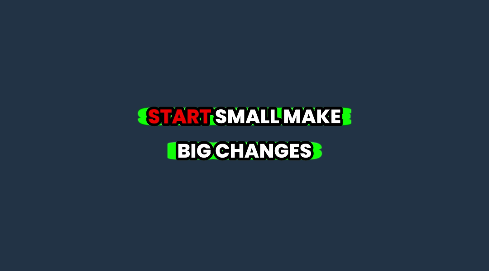
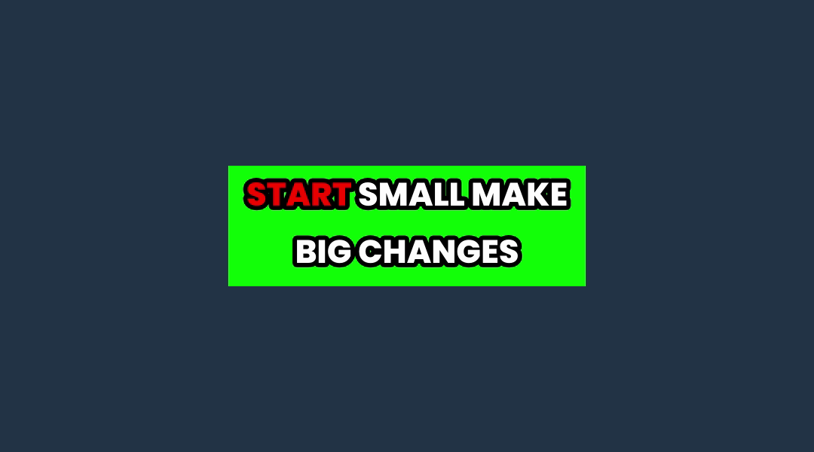

# Studio UI review

These examples use synthetic videos, local test folders and mock provider metadata. No private media, provider keys or paid clipping runs are included.

The **before** images were captured from upstream `main` at `b996820`, except the caption editor comparison at `e09c091`, caption browser at `0a09f2d`, Library details at `6dc143a`, the caption default setting at `5d60f04`, karaoke preview at `385cdee`, and baked background at `df4eb09`, all from earlier versions of this PR. The **after** images show this change on macOS. Automated checks also cover compact windows and reduced motion.

## Before and after

| Area | Before | After |
| --- | --- | --- |
| Create → Review |  |  |
| Create → Captions |  |  |
| Jobs |  |  |
| Library |  |  |
| Library item details |  |  |
| Delete a Library item |  |  |
| Settings → Content storage |  |  |
| Captions editor |  |  |
| Default caption |  |  |
| Caption browser |  |  |
| Karaoke preview |  |  |
| Baked caption background |  |  |
| Posts |  |  |

The baked-background comparison uses a bright green background to expose its bounds: 24 horizontal padding, 4 vertical padding, two lines, and a 6-pixel text outline. Both images are actual FFmpeg renders with the same settings. A separate editor check selects an updated preset and verifies these bounds in the exported MP4.

## Storage cleanup

Review published clips and the estimated space they occupy before removing local copies. Fully posted, finished projects can be removed together; mixed projects keep their unposted clips and unfinished edits.

Review & edit users also see retained source videos and editor previews. Select finished projects to free their media while keeping exports; projects with clips still to finish stay protected. Automatic-only libraries do not show this source section.

## Captions lab

**Default caption** chooses the preset used for new clips in Create and Chat. Choose a built-in or saved custom preset, or **First bookmark** to prefer bookmarked custom presets, then built-in styles (Pop when there are no available bookmarks). The setting survives restarts and leaves existing drafts unchanged.

Choose a default as a starting point, then adjust your own preset with a live preview. Switch between short and long voice samples, or select a caption line to jump to it. This example shows two balanced lines with separate horizontal and vertical background padding.

Once presets are saved, the page opens with matching three-column card grids and a New preset action. Select a custom preset card to preview it without opening an edit; its **…** menu offers edit, duplicate and delete. Default styles remain below Your presets, and both use the same preview on the left. Edit swaps the list for controls without moving or resizing that preview.

Bookmarks move smoothly to the front of their existing list without changing the preview or losing keyboard focus. The bookmark icon also follows its card's hover lift. Reduced motion skips these movements.

Previews on the Captions page open paused with sample text visible, even with sound enabled. Play starts the recording; switching styles or reopening the page returns to a still preview.

In Create and the clip editor, **Favorites** filters the picker to your bookmarks while keeping default and custom styles separate. Bookmarks are retained across app launches. With **First bookmark** selected, new clip setups select bookmarked custom presets before bookmarked built-in styles, or Pop when there are none; explicit choices stay selected.

Saving keeps the editor open. Leaving unsaved changes offers save, discard and cancel; reload and app close also ask whether to save.

## Library item details

The source card and a compact 2×2 grid of run statistics share the top row equally, with saved metadata available immediately. The panels stack in smaller windows. Search, sorting and selection share one toolbar; selecting clips reveals the bulk actions. Continue editing remains a primary action. The **…** menu holds transcript inspection, processing details, folder access and post-status refresh. Editorial weights appear only when using Editorial sorting.

Run statistics stay visible beside the source; the Processing details dialog contains stage timings and model usage. Keyboard checks cover opening the menu, focus inside the dialog and returning to the menu trigger. Compact-window checks include selection and bulk actions; older runs and unavailable local sources still show their saved title and duration.

## Dismissed posting activity

Clearing finished updates from Posts keeps the clip in the Library’s Posted group. These two screens show the same synthetic clip after dismissing its activity and reloading; its online post and cleanup eligibility are also preserved.

| Posts after dismissal | Library after dismissal |
| --- | --- |
|  |  |

## Crash reports

Settings → About lets users review and copy the latest local report, then add reproduction steps to a GitHub issue. The report contains safe diagnostics and recent event names; it excludes keys, paths, URLs and raw error messages. This example uses a simulated interface error.

## Pagination in motion

A short recording of moving between Previous pages, including the shorter final page, then changing the count from 10 to 25 and back. The app remembers the selected count across navigation and restarts.

