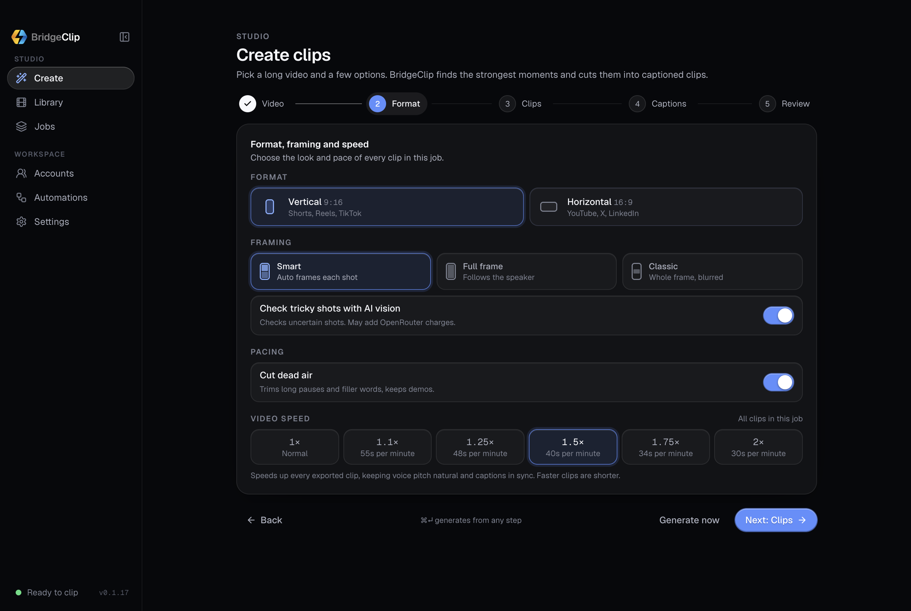

# Video speed for clipping jobs

Implements the request from @etristemaseverdade172 to speed up all clips in a
clipping job. The control lives in Create → Format alongside pacing. Normal
speed is the default; faster presets are 1.1×, 1.25×, 1.5×, 1.75× and 2×.
Review shows the choice before generation, the running job shows its speed,
and saved results identify faster exports. The draft retains it across navigation and “Clip another video”.



## Timing and exports

- One speed applies to every clip, for local files and downloaded videos,
  vertical and horizontal output, and all clipping modes.
- Transcription, planning, trim boundaries, and clip-length choices remain in
  source time. Pacing cuts happen first. Export duration is the kept duration
  divided by speed (within frame and codec rounding).
- Video is retimed after framing, captions, titles, and banners are composited.
  Audio uses pitch-preserving `atempo`, with a bounded sample count and the
  final sample clock retained. See the [FFmpeg filter documentation](https://ffmpeg.org/ffmpeg-filters.html#atempo).
- Silent input uses only the video transform. Subtitle sidecars and chapters
  use the sped-up timeline; chapter minimum spacing is checked after scaling.
- Every render fallback preserves speed. A failed speed transform fails the
  clip through the existing failure path instead of silently exporting at 1×.
- The exported MP4 contains the speed change, so preview, download, and posting
  all use the same media without a second playback-speed adjustment.

## Compatibility and verification

`videoSpeed` crosses desktop IPC as a number and becomes `video_speed` in the
bridge/engine request. Missing values default to 1; malformed, non-finite,
slower-than-1, and faster-than-2 values are rejected. The bridge contract is
version 2 so older engines cannot silently ignore the option. Saved metrics
include `requested_settings.video_speed`; older results still load normally.

Tests cover keyboard selection and submission in Electron, default and invalid
values, bridge forwarding, draft retention, render fallbacks, sidecars, chapters,
and real exports at every preset. The media tests measure flash/beep timing,
audio frequency, exported duration, and burned captions, including silent input,
nonzero source seeks, delayed audio, cuts, and overlays.

```sh
TEST_FFMPEG="$PWD/engine-bin/ffmpeg" \
TEST_FFPROBE="$PWD/engine-bin/ffprobe" \
TEST_FFMPEG_DIR="$PWD/engine-bin" \
PYTHONPATH=engine engine/.venv/bin/python -m pytest -q engine/tests/test_video_speed.py
node --test tests/main/video-speed.e2e.cjs
```
